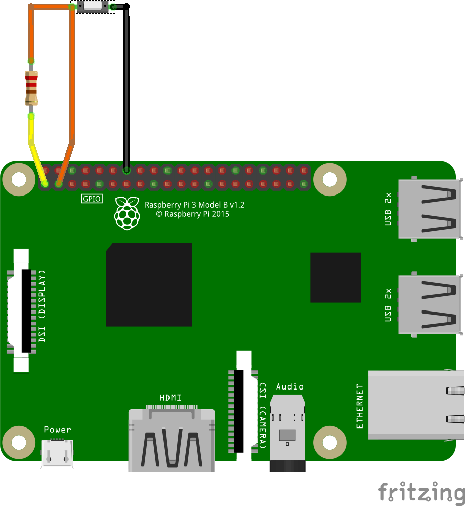

# homebridge-gpio-switch
This Homebridge plugin enables you to read the state of a switch connected to the gpio and expose it in HomeBridge as StatelessProgrammableSwitch. It support single, double and long press.

## Setup

1) Wire whatever kind of switch (pushbutton is better) you prefer to your Raspberry Pi with a pullup resistor.



2) Install this plugin

```bash
cd /usr/local/lib/node_modules
git clone https://github.com/andrimanna/homebridge-Gpio-Switch
npm install -g --unsafe-perm rpi-gpio
```

3) Edit your `/root/.homebridge/config.json` and integrate your switch in the accessories array. The pins
of the Raspberry Pi require root rights to control them.
Accessory JSON config looks like:

```bash
{
    "accessory": "SPSwitch",
    "name": "Pulsante",
    "pin": 3
}
```
